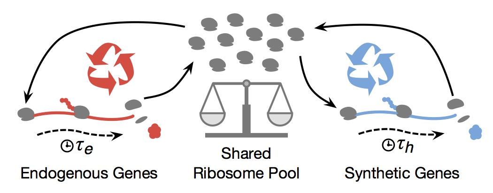

# RiboAlloc

A minimal model of ribosome allocation between endogenous and synthetic genes within a cell. The code is developed in MATLAB and has been tested using MATLAB 2014b. The model is defined in `riboalloc.m` and an example of how it is used is given in `riboalloc_example.m`.

All code is released under the GNU GPLv3 licence and if you make use of this work in any research we ask that the following paper is cited:

> Gorochowski T.E., Avcilar-Kucukgoze I., Bovenberg R.A.L., Roubos J.A., Ignatova Z. (2016) __A minimal model of ribosome allocation dynamics captures trade-offs in expression between endogenous and synthetic genes.__ (under review)
